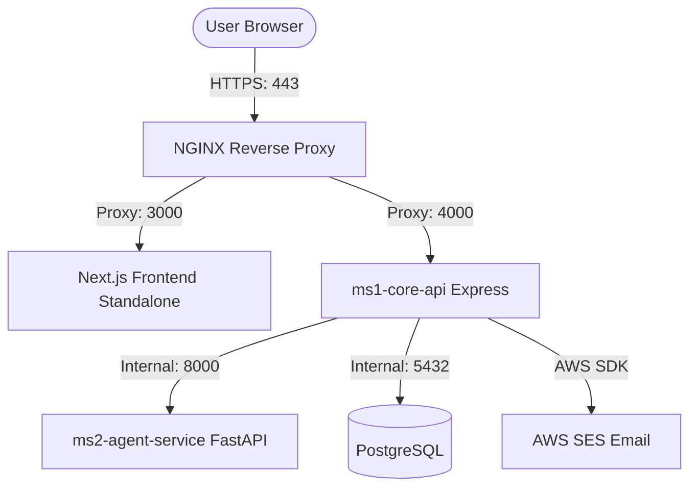

# EcoMatch — AWS EC2 Production Deployment Guide

This guide describes how to deploy the EcoMatch services (frontend, ms1-core-api, ms2-agent-service) to a production AWS EC2 instance using Docker Compose and NGINX.

---

## 1. Architecture Overview



All services run inside a single Docker network on the EC2 instance, with NGINX acting as the secure gateway to the public internet.

---

## 2. Docker & Environment Readiness Check

The Dockerfiles for all three services are optimized for multi-stage production builds and security hardening:
- [x] **ms1-core-api**: Uses a multi-stage Node 20 Alpine build. Compiles TypeScript to JavaScript in `builder` stage, runs in `runner` stage with `npm ci --omit=dev`, non-root user `node`, built-in HTTP healthcheck, and copied migration files.
- [x] **ms2-agent-service**: Uses a multi-stage Python 3.11 slim build. Installs requirements in `builder` stage, runs in `runner` stage with non-root system user `appuser`, `PYTHONUNBUFFERED=1`, and httpx healthchecks.
- [x] **frontend**: Uses a multi-stage Node 20 Alpine build leveraging Next.js `standalone` mode. Compiles standalone server bundle in `builder` stage, runs minimal `node server.js` in `runner` stage under non-root `nextjs` user.

### CORS Configuration
The Express backend has been updated to dynamically allow requests from your production frontend URL:
```typescript
app.use(cors({
  origin: process.env.FRONTEND_URL || 'http://localhost:3000',
  credentials: true
}));
```

---

## 3. Production Environment Variables

Create two separate `.env` configuration files or a root `.env` file on the host:

### Root `.env` (for Docker Compose)
```bash
NODE_ENV=production
POSTGRES_USER=ecomatch
POSTGRES_PASSWORD=your_secure_postgres_password
POSTGRES_DB=ecomatch
JWT_SECRET=your-extremely-secure-jwt-key
FRONTEND_URL=https://your-domain.com
NEXT_PUBLIC_API_BASE_URL=https://api.your-domain.com
AWS_REGION=us-east-1
AWS_ACCESS_KEY_ID=your-aws-key
AWS_SECRET_ACCESS_KEY=your-aws-secret
USE_LLM=true
LLM_MODEL=claude-3-haiku-20240307
ANTHROPIC_API_KEY=your-anthropic-api-key
SCOUT_CONFIDENCE_THRESHOLD=0.7
ALCHEMIST_CONFIDENCE_THRESHOLD=0.7
```

---

## 4. Host Setup & Run Steps (on EC2)

### Step 1: Install Docker & Docker Compose
```bash
# Update packages
sudo apt update && sudo apt upgrade -y

# Install Docker
sudo apt install docker.io -y
sudo systemctl start docker
sudo systemctl enable docker
sudo usermod -aG docker ubuntu

# Install Docker Compose
sudo curl -L "https://github.com/docker/compose/releases/latest/download/docker-compose-$(uname -s)-$(uname -m)" -o /usr/local/bin/docker-compose
sudo chmod +x /usr/local/bin/docker-compose
```

### Step 2: Clone & Configure
Clone the repo on your EC2 instance and write the `.env` file shown in Section 3.

### Step 3: Run the Stack with Production Compose
Build and launch all containers (including automatic database migration execution) in the background:
```bash
docker-compose -f docker-compose.prod.yml up -d --build
```

---

## 5. NGINX Reverse Proxy & SSL Setup

### Step 1: Install NGINX & Certbot
```bash
sudo apt install nginx certbot python3-certbot-nginx -y
```

### Step 2: Configure Server Block
Edit `/etc/nginx/sites-available/ecomatch` to route traffic:

```nginx
server {
    server_name your-domain.com api.your-domain.com;

    location / {
        # Route to frontend
        if ($host = your-domain.com) {
            proxy_pass http://localhost:3000;
        }
        # Route to ms1-core-api
        if ($host = api.your-domain.com) {
            proxy_pass http://localhost:4000;
        }
        
        proxy_http_version 1.1;
        proxy_set_header Upgrade $http_upgrade;
        proxy_set_header Connection 'upgrade';
        proxy_set_header Host $host;
        proxy_cache_bypass $http_upgrade;
    }
}
```
Link and reload NGINX:
```bash
sudo ln -s /etc/nginx/sites-available/ecomatch /etc/nginx/sites-enabled/
sudo nginx -t
sudo systemctl reload nginx
```

### Step 3: Obtain SSL Certificate
```bash
sudo certbot --nginx -d your-domain.com -d api.your-domain.com
```

---

## 6. AWS SES Verification Checklist
Since you are in Sandbox mode initially:
1. **Verify Sender Email/Domain**: Go to AWS SES console and verify your sending domain (e.g. `your-domain.com`) or sender email addresses.
2. **Verify Recipient Emails**: If in Sandbox, AWS SES will block emails sent to unverified addresses. You must verify recipient test emails (e.g., `generator@example.com`, `composter@example.com`) or request production access to lift the sandbox restrictions.
