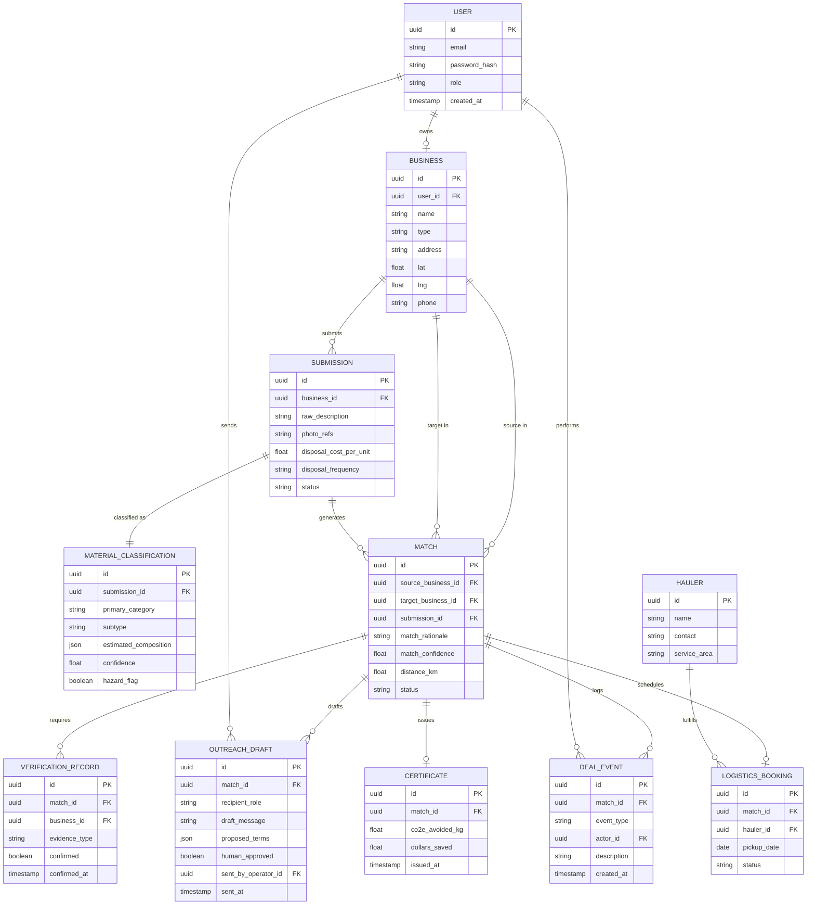

# EcoMatch — Database Schema

**See also:** `PRD.md` (features/users) · `architecture.md` (system design) · `rules.md` (build constraints) · `phases.md` (rollout plan)

Single PostgreSQL database, shared by ms1 and ms2. **ms1 owns all migrations** — ms2 reads/writes classification and agent-output tables but never changes schema.

---

## 1. Entity-Relationship Diagram

## 2. Entity Responsibilities

| Entity | Responsibility |
|---|---|
| `users` | Login + role (`business` or `operator`). Every audit-trail actor traces back here. |
| `businesses` | Company profile — name, type, location, contact. One user has at most one business. **No separate "buyer"/"seller" role** — `type` plus which side of a given `match` a business sits on is what determines its role in that deal (`PRD.md` §3). |
| `submissions` | One "I have surplus material" report — raw input before classification. |
| `material_classifications` | The Scout Agent's structured read of a submission. Owns `hazard_flag` — the single most safety-critical field in the schema. |
| `matches` | One proposed pairing between a `source_business_id` and `target_business_id` (both FKs into `businesses`) plus the Alchemist Agent's rationale and confidence. Owns `status`, the source of truth for pipeline position. |
| `outreach_drafts` | The Negotiator Agent's drafted message + terms for one side of a match. `human_approved` + `sent_by_operator_id` make the human-approval gate enforceable in data, not just UI. |
| `deal_events` | Full audit log — every state change, approval, and manual note, timestamped and attributed. |
| `verification_records` | Proof of actual reuse, one row per business per match. Both must be `confirmed` before a certificate can exist. |
| `certificates` | Final output — verified CO2e avoided + dollars saved. Optional, 1:1 with `matches`, only created after both verifications pass. |
| `haulers` | Curated pickup/transport providers (manual list in Phase 1). |
| `logistics_bookings` | Tracks whether/how pickup was arranged for an agreed match. |

## 3. Relationship Notes

- **`MATCH` has two separate FKs into `BUSINESS`** (`source_business_id`, `target_business_id`) rather than a many-to-many join table — a match is directional, not symmetric.
- **`OUTREACH_DRAFT` and `VERIFICATION_RECORD` each expect exactly two rows per `MATCH`** (one per side). The ERD's cardinality shows "many," but the "exactly two" constraint is application-level, not a pure FK constraint — enforce it in ms1 service logic and cover it with a test.
- **`CERTIFICATE` and `LOGISTICS_BOOKING` are optional 1:1 with `MATCH`** — most matches will exist for a long time without either.
- **`MATERIAL_CLASSIFICATION.hazard_flag` has no direct FK-level enforcement** — a hazardous classification must never have a corresponding `MATCH` row, but this is a service-layer rule (`rules.md` §4.1), not something the schema alone can guarantee.

## 4. Non-Hazardous Category Taxonomy (v1 scope)

Single source of truth lives in code at `ms2-agent-service/app/reference_data/categories.py` — this table is documentation, not the authoritative list:

| Category | Example materials |
|---|---|
| Organic biomass | Food scraps, spent grain, coffee grounds |
| Cardboard & paper | Packaging, offcuts |
| Used cooking oil | Restaurant/kitchen waste oil |
| Textile offcuts | Fabric scraps |
| Wood pallets / untreated wood | Pallets, crating |
| Packaging plastic | Clean, non-food-contaminated only |

Any submission classified outside this list gets `hazard_flag = true` and is routed to a "not currently supported" response — never passed to the Alchemist or Negotiator agents.

## 5. Data-Level Constraints Checklist

These mirror `rules.md` §4 but are restated here as schema/migration concerns:

- [ ] Foreign key constraints on every `*_id` column listed above
- [ ] `material_classifications.hazard_flag` indexed — the hazard-check query runs on every submission
- [ ] `matches.status` constrained to an enum matching the pipeline states in `architecture.md` §5
- [ ] `outreach_drafts.human_approved` and `sent_at` — application logic must guarantee `sent_at` is never set while `human_approved` is false (add a check constraint or a DB trigger if the team wants defense-in-depth beyond service-layer enforcement)
- [ ] `certificates` insert path should be guarded by a service-layer check that both related `verification_records.confirmed = true` — not achievable as a pure SQL constraint across two rows, must be application-enforced
